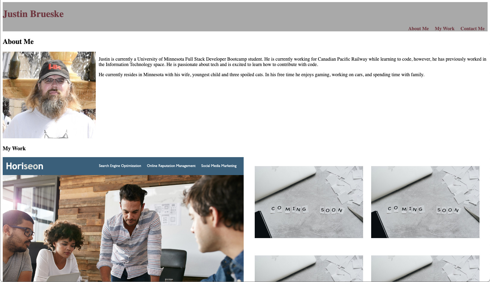

## justin-portfolio
My portfolio page

## Description
This was a project to create a portfolio page that showcases an About Me section and a Project section. The main naviagiton uses anchor links to jump to the relevant section of the page.

## Completed Task
* Created Main Navigation
* Created an About Me section
* Created a Projects section
* Added styles that support a responsive desgin
* Added hover styles for projects
* Added links to Project tiles for existing non-placeholder projects

## Links

[Code Repository](https://github.com/Justin-Brueske/justin-portfolio)

[Deployed Site](https://justin-brueske.github.io/justin-portfolio/)

## Usage

Can be viewed on a desktop or mobile web browser.

